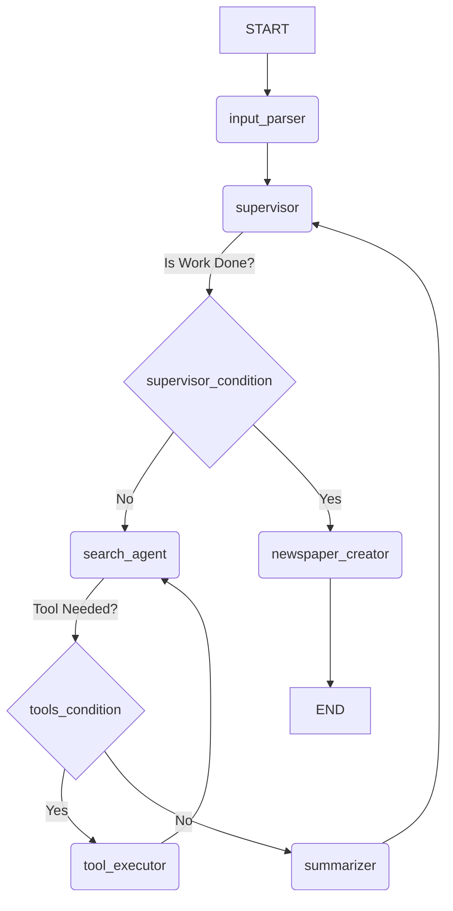

# The Daily Agent 📰 - A Smart AI Newspaper Generator

 **The Daily Agent** is an advanced, multi-agent application built with Python, LangChain, and LangGraph that autonomously generates a personalized daily newspaper based on a user's natural language request. It can create a general-interest newspaper with standard sections or a special report focused on specific topics mentioned by the user.

---
## 🎬 Live Demo


---
## ✨ Key Features

* 🗣️ **Natural Language Understanding:** The agent intelligently parses user requests to handle three scenarios: General Edition, Special Report, and Hybrid requests.
* 🤖 **Advanced Multi-Agent Architecture:** Built using LangGraph, the system orchestrates a team of specialized agents (Supervisor, Searcher, Summarizer, Creator) to complete its tasks.
* 🧠 **Self-Correcting Search:** The search agent is designed to be resilient. If its initial search yields poor results, it's prompted to reformulate its query and try again.
* 📊 **Robust Structured Output:** Uses Pydantic models to enforce a strict, predictable data structure for all information processed by the agent, ensuring reliability.
* ✍️ **Dynamic Newspaper Generation:** The final agent acts as an "Editor-in-Chief," creatively composing the gathered summaries into a polished, newspaper-style final report.
* 🖥️ **Interactive Web Interface:** A clean and user-friendly front-end built with Streamlit allows for easy interaction with the agent.

---
## ⚙️ How It Works (Architecture)

The agent's logic is built as a stateful graph using LangGraph. The flow is orchestrated by a supervisor and a series of conditional edges that route the task between specialized nodes.

1.  **Input Parser:** The user's request is first parsed to determine their intent (general, specific, or hybrid) and to create a list of topics to research.
2.  **Supervisor:** The supervisor acts as the main loop controller. It takes one topic from the list and assigns the `search_agent` its mission.
3.  **Search Loop (ReAct):** The `search_agent` enters a "Reason and Act" loop, using its search tool to find relevant articles.
4.  **Summarizer:** Once the search is complete, the `summarizer` node receives the raw search data and formats it into structured `ArticleSummary` objects.
5.  **Return to Supervisor:** The flow returns to the supervisor to check if there are more topics to process.
6.  **Newspaper Creator:** Once all topics are complete, the final `newspaper_creator` node composes the human-readable newspaper.

### Graph Visualization


---
## 🛠️ Tech Stack

* **Backend:** Python
* **AI & Orchestration:** LangChain, LangGraph
* **LLMs:** Groq Cloud
* **Tools:** Tavily Search
* **Data Validation:** Pydantic
* **Frontend:** Streamlit

---
## 🚀 Setup and Installation

Follow these steps to run the project locally.

### 1. Clone the Repository
```bash
git clone https://github.com/ChidambaraRaju/langgraph-news-agent
cd langgraph-news-agent
```

### 2. Create a Virtual Environment
```bash
# Using uv (as you are)
uv venv

# Activate it
source .venv/bin/activate  # On Windows, use `.venv\Scripts\activate`
```

### 3. Install Dependencies
```bash
uv add -r requirements.txt
```

### 4. Set Up Environment Variables
Create a file named `.env` in the root of your project folder and add your API keys:
```
GROQ_API_KEY="YOUR_GROQ_API_KEY_HERE"
TAVILY_API_KEY="YOUR_TAVILY_API_KEY_HERE"
```

---
## 🏃‍♀️ Usage

To run the web application, execute the following command in your terminal from the project's root directory:

```bash
streamlit run app.py
```
Your web browser will open a new tab with the application running. Simply type your request into the input box and press "Generate Newspaper"!

---
## 📁 Project Structure

```
/smart_newspaper_agent/
|
|-- agent/
|   |-- __init__.py
|   |-- state.py
|   |-- nodes.py
|   |-- graph.py
|
|-- config.py
|-- app.py
|-- requirements.txt
|-- .env
|-- README.md
```
